# kernel-fuzzer

## como funciona afl

vamos a instrumentar el ejercicio que hice para hackthebox para ver que parte se le agregan al binario y analizar que modificaciones le hace la instrumentacion de afl

compilamos nuestro challenge:

```c++
#include <iostream>
#include <fstream>
#include <string.h>
#include <unistd.h>

#define MAX_ANIMALS 10

using namespace std;

class Animal {
    public:
        string name;

        Animal() {
            cout << "Fabricando animalito " << endl;
        }
        
        virtual void talk(string) {};
};

class Cat : public Animal {
    public:
        void talk(string phrase) {
            cout << " _               "<< string(phrase.length(), '_') << endl;
            cout << "( \\             (" << phrase << ")" << endl;
            cout << " ) )             " << "-," << string(phrase.length()-2, '-') << endl;
            cout << "( (  .-''''-.  A.-.A" << endl;
            cout << " \\ \\/        \\/ , , \\" << endl;
            cout << "  \\   \\      =;  t  /=" << endl;
            cout << "   \\   |''''-  ',--'" << endl;
            cout << "    / //    | ||" << endl;
            cout << "   /_,))    |_,))" << endl;
        
        }
};

class Toad : public Animal {
    public:
        void talk(string phrase) {
            cout << "      " << string(phrase.length(), '_') << endl;
            cout << "     (" << phrase << ")" << endl;
            cout << "      -," << string(phrase.length()-2, '-') << endl;
            cout << "  @..@" << endl;
            cout << " (----)" << endl;
            cout << "( >__< )" << endl;
            cout << "^^ ~~ ^^" << endl;
        }
};

class Dog : public Animal {
    public:
        void talk(string phrase) {
            cout << "       " << string(phrase.length(), '_') << endl;
            cout << "      (" << phrase << ")" << endl;
            cout << "       -," << string(phrase.length()-2, '-') << endl;
            cout << "    ___" << endl;
            cout << "---'o  \\                         ,"<< endl;
            cout << "\\,__ | )                        ))" << endl;
            cout << "     \\;_/\\---------------------~//" << endl;
            cout << "     \\                           )" << endl;
            cout << "      (  .____________________. (\\" << endl;
            cout << "       ) ))                    ) ))" << endl;
            cout << "      '-''                    '_''" << endl;
        }
};

class ParserHistory {
    ifstream story;
    Animal *character[MAX_ANIMALS];
    unsigned int i=0;
    public:
        ParserHistory(char *fileName, bool verbose) {
            char data[100], *textLine, *repeatedLine;
            unsigned int tag;
            unsigned short characterIndex, lengthMessage, howMany;
            string animal;
            
            this->story.open(fileName);
            memset(data, 0, sizeof(data));
            
            this->story.read(data, 11);
            
            if (strncmp(data, "LINUXSTORY#", 11) == 0) {
                if (verbose) {
                    cout << "Header detected" << endl;
                }
                
                do {
                    tag = 0;
                    this->story.read((char *)&tag, 3);
                    
                    if ( this->i <= MAX_ANIMALS ) {
                        if ( tag == 0x544143  ) {
                            character[this->i] = new Cat();
                            if (verbose ) {
                                cout << "cat memory address: " << hex << character[this->i] << endl;
                            }
                        } else if ( tag == 0x474f44 ) {
                            character[this->i] = new Dog();
                            if (verbose) {
                                cout << "dog memory address: " << hex << character[this->i] << endl;
                            }
                        } else if ( tag == 0x414f54) {
                            character[this->i] = new Toad();
                            if (verbose) {
                                cout << "toad memory address: " << hex << character[this->i] << endl;
                            }
                        }
                        this->i++;
                    }
                } while( tag != 0x444e45 );
                
                do {
                    tag = 0;
                    characterIndex = 0;
                    //memset(textLine, 0, sizeof(textLine));
                    
                    this->story.read((char *)&tag, 1);
                    
                    if ( tag == 'T' ) {
                        this->story.read((char *)&characterIndex, 2);
                        
                        if ( characterIndex < this->i ) {
                            this->story.read((char *)&lengthMessage, 2);
                            
                            if (lengthMessage <= 1024) {
                                textLine = new char(lengthMessage);
                                if (verbose) {
                                    cout << "string memory address: " << static_cast<void *>(textLine) << endl;
                                }
                                
                                if (textLine != NULL) {
                                    this->story.read(textLine, lengthMessage);
                                    this->character[characterIndex]->talk(textLine);
                                }
                            }
                        }
                    } else if ( tag == 'F' ) {
                        this->story.read((char *)&characterIndex, 2);
                        if (verbose) {
                            cout << "tag freed" << endl;
                            cout << "memory deleted: " << hex << character[characterIndex] << endl;
                        }
                        
                        delete this->character[characterIndex];
                    } else if (tag == 'C') {
                        this->story.read((char *)&characterIndex, 2);
                        
                        if ( characterIndex < this->i ) {
                            this->story.read((char *)&howMany, 2);
                            this->story.read((char *)&lengthMessage, 2);
                            
                            repeatedLine = new char(lengthMessage);
                            this->story.read(repeatedLine, lengthMessage);
                            
                            for(unsigned int i=0; i <= howMany; i++) {
                                textLine = new char(lengthMessage);
                                if (verbose) {
                                    cout << "string memory address: " << static_cast<void *>(textLine) << endl;
                                }
                                
                                strncpy(textLine, repeatedLine, lengthMessage);
                                this->character[characterIndex]->talk(textLine);
                            }
                        }
                        
                    } else {
                        if (verbose) {
                            cout << "invalid tag: " << tag << endl;
                        }
                    }
                } while( tag != 0x00);
                
            }
        }
};

int main(int argc, char **argv) {
    int opt;
    bool verbose;
    char *fileName;
    ParserHistory *director;
    
    verbose = false;
    while((opt = getopt(argc, argv, "f:v")) != -1) {
        switch(opt) {
            case 'f':
                cout << "[*] History file: " << optarg << endl;
                fileName = optarg;
                break;
            case 'v':
                verbose = true;
                break;
            default:
                cout << "[-] Unrecogniced option: " << opt << endl;
                break;
        }
    }
    
    director = new ParserHistory(fileName, verbose);
    return 0;
}
```

para compilarlo basta con:

```console
afl-g++ -o orange-afl orange-afl.cpp
afl-cc 2.52b by <lcamtuf@google.com>
afl-as 2.52b by <lcamtuf@google.com>
[+] Instrumented 302 locations (64-bit, non-hardened mode, ratio 100%).
```

## fuzzeando

para probar como se fuzzea, se le puede pegar desde un sample mas o menos armado, al toque encuentra los crashes

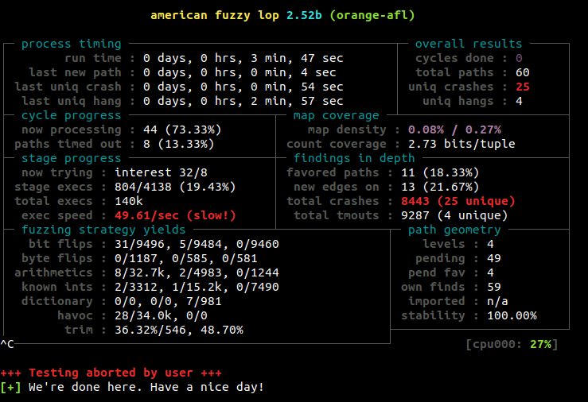

## abriendo con ghidra

lo abrimos y al toque vemos que el main tiene incrustados un monton de calls a zonas nombradas \_\_afl\_maybe\_log

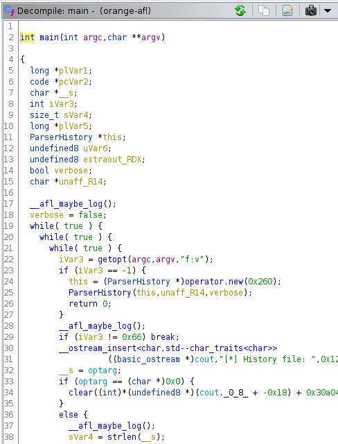

estos calls a la funcion esa, se agregan por todo el binario, como podemos ver en la siguiente imagen:

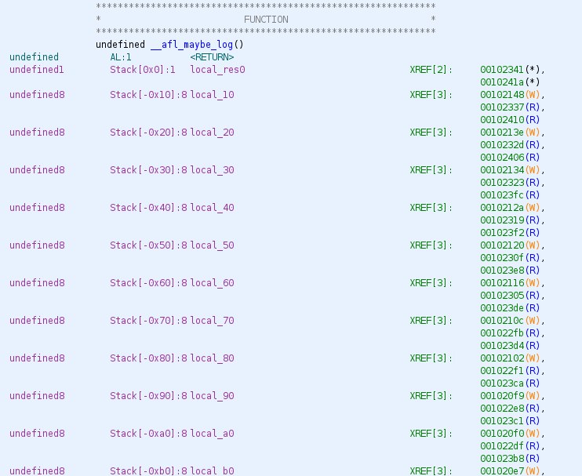

el arranque del injerto solo verifica si la variable global \_\_afl\_area\_ptr ya fue definida (es decir si ya paso una vez), en caso de que no este initialized, procede a cargarla saltado a \_\_afl\_setup


vamos a mirarlo como graph para darnos una idea de que es:

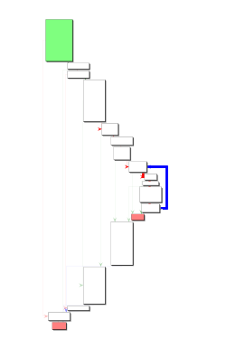

claramente es una serie de if encadenaditos con algun bucle dentro, haciendole zoom al primer basic block, vemos que estamos parados ahi


los primeros 3 basic blocks verifican si:
* \_\_afl\_area\_ptr no esta inicializado
* \_\_afl\_setup\_failure no esta en true
* \_\_afl\_global\_area\_ptr esta en NULL

ejecuta esta zona donde carga el estado de todos los registros (esto es para preservar el estado que tiene el proyecto en la zona donde se va a forkear)

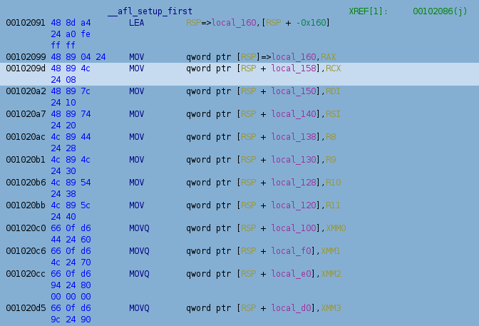

ahora recien ahora hace espacio en el stack para alvergar algunas variables y llama a getenv("AFL\_SHM\_ENV"), se esta activa es como que le dice "NO INSTRUMENTES" y se va para el \_\_afl\_setup\_abort


y solo para saber un poquito mas, nos vamos a ver que es la funcion \_\_afl\_setup\_abort


pone en 1 (true?puede ser mas incrementado) \_\_afl\_setup\_failure restaura los registros como cuando estaban en el main y salta a un violento \_\_afl\_return


la inversa del prologo raro (me parece que tiene algo que ver con los flags, si entro por ser mayor, por ser menor, altera los flags y cambian de valor)


si esta todo bien, y no pasa por esa zona oscura, aterriza por aca:

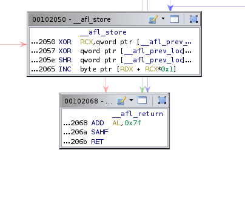

que es el algoritmo que explica el chabon en sus famosos tutoriales

```c
  cur_location = <COMPILE_TIME_RANDOM>;
  shared_mem[cur_location ^ prev_location]++; 
  prev_location = cur_location >> 1;
```

en el chunk de assembler que pegue, esta hasta la asignacion final, fijense aca:

```asm
INC byte ptr [RDX+RCX*0x1]
```

RDX ahi tiene la base del unsigned int array \_\_afl\_area\_ptr y RCX indexa como char (lo digo por el \*0x1)

la zona de memoria compartida de afl tiene un size de 64k, es decir 65536 bytes, entonces probablemente cur\_location y prev\_location deben ser unsigned short int

cur\_location es un numero random para identificar el basic bloc que se pasa por ECX como argumento del CALL:


en la anterior imagen se puede ver como se carga RCX con un valorcito para identificar la zona, en ese caso 0xd435

aca tenemos otro ejemplo:


aca podemos ver que en cada basic block que se va para adentro, anade el marcador ese

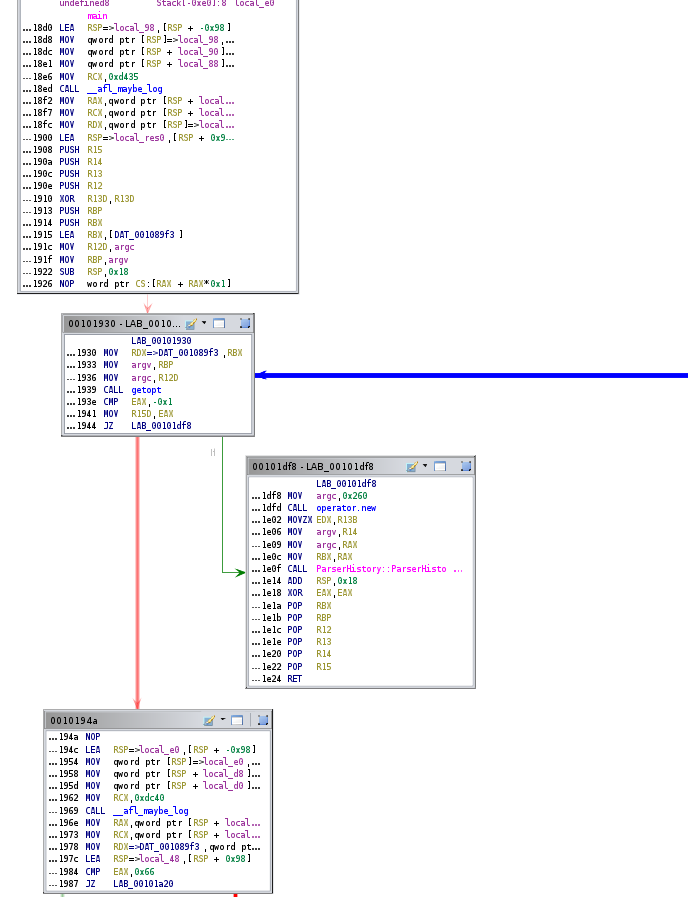

hay algunos que no le da importancia como por ejmplo los dos que no tienen marcador

pero si vamos un poco mas para adentro del parser, vemos que le metio a los demas


no sabemos a ciencia cierta como es que elige que basic blocks instrumenta y cuales no, pero no nos interesa para nuestro trabajo final

tambien podemos notar, que se pasan mas argumentos de los que creiamos pero sin embargo no le da mucho bola dentro de la funcoin, asi que evitaremos analizarlos

## si tenemos AFL\_SHM\_ENV

si tenemos activa esa variable de entorno entonces transforma ese ascii que consulto a int con atoi y lo usa como shmid para definir el identificador de la memoria compartida

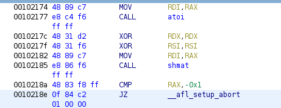

segundo y tercer argumento estan en NULL (por lso dos xor que hay), shmat tiene la siguiente definicion:

```c
#include <sys/types.h>
#include <sys/shm.h>

void *shmat(int shmid, const void *shmaddr, int shmflg);
```

en ese caso, nuestra llamada es:

```c
shmat(atoi(getenv("ALF_SHM_ENV")), NULL, 0);
```

el hecho de que shmaddr fuera NULL, the system choose a suitable (unused) page-aligned address to attach the segment. El flag 0 no se que caracteristica magica le aporta

todo esto se esta ejecutando en el caminito \_\_afl\_setup\_first


luego de preguntar cual era el area que le asigno a la shared memory lo guarda en \_\_afl\_area\_ptr y \_\_afl\_global\_area\_ptr

## forkserver

envia un mensajito de 4 caracteres al canal de comunicacion que tiene abierto con el forkserver

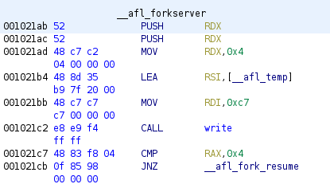

no se como sabe que el file descriptor es 0xc7, no nos vamos a centrar en eso, pero en caso de que responda que no le llegaron bien los 4 caracteres, se va al resume

que solo cierra los descriptores fijos de comunicacion con el forkserver

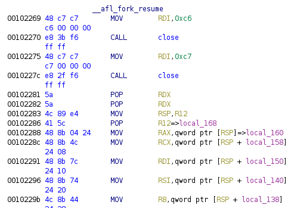

como siempre hagamos de cuenta que salio todo bien y le llegaron los 4 bytes

ahora queda bloqueante, esperando que el server le envie 4 bytes

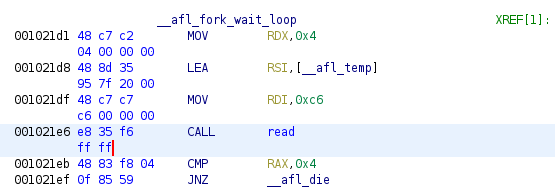

luego viene este bucle:


si el fork retorna error, se toma la flecha verde y se va con un exit

si retorna cero, significa que es el proceso duplicado, el hijo y esta parado en la misma zona pasando el CALL

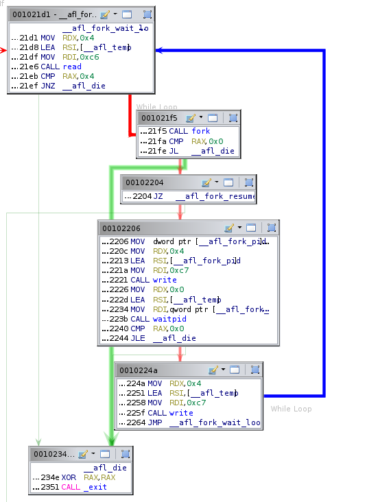

cierra el canal donde writeaba y leia, restaura los registros, storea la posicion hitteada y sale

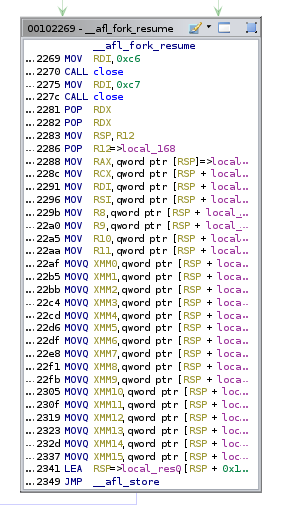

si es el padre, retorna el PID del proceso el fork entonces se va para aca

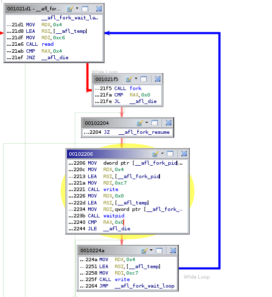

la parte que justo se corto es la porcion de codigo que envia el PID del hijo por el canal de comunicacion:


y se queda esperando hasta que termine el proceso con el waitpid, como el segundo argumento de waitpid no es NULL, entonces storeara un entero que avisa como fue que murio el proceso:

```c
#include <sys/types.h>
#include <sys/wait.h>

pid_t waitpid(pid_t pid, int *wstatus, int options);
```

y por ultimo envia wstatus por el canal de comunicacion

con esto puede saber si el proceso faulteo o salio aireoso

## como registro el handler 199 y 198?

una de las preguntas que me genera ese codigo, es como logro tener el 199 y 198 para el, veamos el codigo de afl para sacarnos esa duda

crea un pipe y despues duplica el descriptor que se le otorgo, asignandole el 199 y 198:

afl-fuzz.c
```c
if (pipe(st_pipe) || pipe(ctl_pipe)) PFATAL("pipe() failed");
```

y mas abajo:

afl-fuzz.c
```c
    if (dup2(ctl_pipe[0], FORKSRV_FD) < 0) PFATAL("dup2() failed");
    if (dup2(st_pipe[1], FORKSRV_FD + 1) < 0) PFATAL("dup2() failed");

    close(ctl_pipe[0]);
    close(ctl_pipe[1]);
    close(st_pipe[0]);
    close(st_pipe[1]);
```

## que hizo el cristiano este para coverage de kernel?

la pregunta que todos nos hacemos, como logro que este modo que solo funciona para coverage en procesos de user space, lograr usarlo satisfactoriamente para kernel space

### levantando el kernel con virtme

luego de compilar un kernel, lo podemos levantar con virtme para correrlo virtualmente, esto nos trae la ventaja de que si crashea no vamos a perder nada, porque estamos en el virtual

```console
sudo ./virtme-run --rw --pwd --kimg ../linux/arch/x86/boot/bzImage --memory 512M
```

le decimos eso y automagicamente levanta el kernel, nos da una shell de root y nos monta el disco dejandonos acceder a nuestro sistema real


dentro del kernel virtual, corremos

```console
# ./fuzznetlink --dump --verbose
```

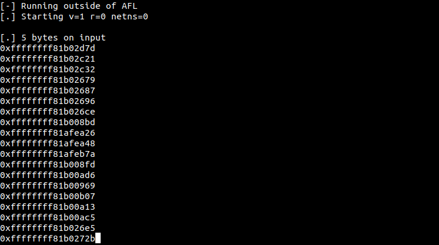

al toque nos da todos los bloques de memoria que se ejecutaron

### como hizo eso?

primero habilito KCOV al momento de compilar el kernel en las zonas que me interesaban, en el tutorial el flaco se quiere centrar en sockets netlink, asi que habilito kernel coverage solo en la carpeta net:

```console
find net -name Makefile \
    | xargs -L1 -I {} bash -c 'echo "KCOV_INSTRUMENT := y" >> {}'
```

en la siguiente foto podemos ver un grep que muestra en que Makefiles se activo kcov:

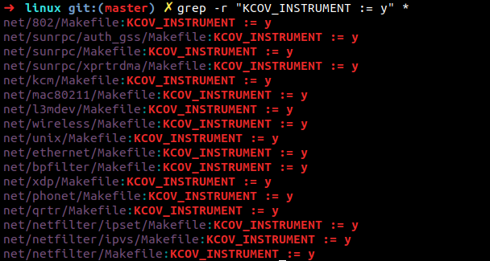

esto nos da la ventaja de poder aislar parcialmente **las zonas que nos interesan auditar**

esto le debe agregar algo a esos basic blocks para que reporten, pero por ahora no le vamos a dar importancia a eso

## como obtiene las direcciones ejecutadas en kernel

en el switch para agarrar los argumentos a lo getopt tiene el procesamiento de 'd':

fuzznetlink.c:84
```c
        case 'd':
            state->dump++;
            break;
```

y mas abajo vemos que si esta prendido este flag, imprime las direcciones en hexa como ya vimos:

fuzznetlink.c:242
```c
            if (state->dump) {
                printf("0x%016lx%s\n", current_loc, "");
            }
```

current\_loc es la direccion que tiene la posta del basic block ejecutado, si vemos el bucle entero que procesa el TRACE

fuzznetlink.c:223
```c
        /* Read recorded %rip */
        int i;
        uint64_t afl_prev_loc = 0;
        for (i = 0; i < kcov_len; i++) {
            uint64_t current_loc = kcov_cover_buf[i + 1];
            uint64_t hash = hsiphash_static(&current_loc,
                            sizeof(unsigned long));
            uint64_t mixed = (hash & 0xffff) ^ afl_prev_loc;
            afl_prev_loc = (hash & 0xffff) >> 1;

            uint8_t *s = &afl_area_ptr[mixed];
            int r = __builtin_add_overflow(*s, 1, s);
            if (r) {
                /* Boxing. AFL is fine with overflows,
                 * but we can be better. Drop down to
                 * 128 on overflow. */
                *s = 128;
            }

            if (state->dump) {
                printf("0x%016lx%s\n", current_loc, "");
            }
        }
```

lo saca del kcov\_cover\_buf indexandolo desde 1 (eso parece raro)

kcov\_cover\_buf es un array de direcciones de 64 bits

fuzznetlink.c:113
```c
    struct kcov *kcov = NULL;
    uint64_t *kcov_cover_buf = NULL;
    if (state->no_kcov == 0) {
        kcov = kcov_new();
        kcov_cover_buf = kcov_cover(kcov);
    }
```

me encanta la falsa orientacion a objetos que armo, divino, vamos a ver kcov\_cover

kcov.c:89
```c
uint64_t *kcov_cover(struct kcov *kcov) { return kcov->cover; }
```

lo unico que hay que saber de la falsa OOP es que siempre le pasa como 1er argumento un pseudo-this

kcov-\>cover fue cargado en el "constructor"

kcov.c:24
```c
struct kcov *kcov_new(void)
{
    int fd = open("/sys/kernel/debug/kcov", O_RDWR);
    if (fd == -1) {
        PFATAL("open(/sys/kernel/debug/kcov)");
    }

    /* Setup trace mode and trace size. */
    int r = ioctl(fd, KCOV_INIT_TRACE, COVER_SIZE);
    if (r != 0) {
        PFATAL("ioctl(KCOV_INIT_TRACE)");
    }

    /* Mmap buffer shared between kernel- and user-space. */
    unsigned long *cover = (unsigned long *)mmap(
        NULL, COVER_SIZE * sizeof(unsigned long),
        PROT_READ | PROT_WRITE, MAP_SHARED, fd, 0);

    if ((void *)cover == MAP_FAILED) {
        PFATAL("mmap(/sys/kernel/debug/kcov)");
    }
    struct kcov *kcov = calloc(1, sizeof(struct kcov));
    kcov->fd = fd;
    kcov->cover = cover;
    return kcov;
}
```

cover es un buffer para almacenar 

kcov.c:14
```c
#define COVER_SIZE (64 << 10)
```

que no es mas que una forma cheta de poner 65536

fijense que esta MAP\_SHARED y los flags, eso debe ser los permisos que necesita para que se le guarden los datos

todo apunta que la parte de carga del trace se hace por aca:

kcov.c:51
```c
void kcov_enable(struct kcov *kcov)
{
    /* reset counter */
    __atomic_store_n(&kcov->cover[0], 0, __ATOMIC_RELAXED);

    int r = ioctl(kcov->fd, KCOV_ENABLE, KCOV_TRACE_PC);
    if (r != 0) {
        PFATAL("ioctl(KCOV_ENABLE)");
    }

    /* Reset coverage. */
    __atomic_store_n(&kcov->cover[0], 0, __ATOMIC_RELAXED);
    __sync_synchronize();
}
```

\_\_atomic\_store\_n
